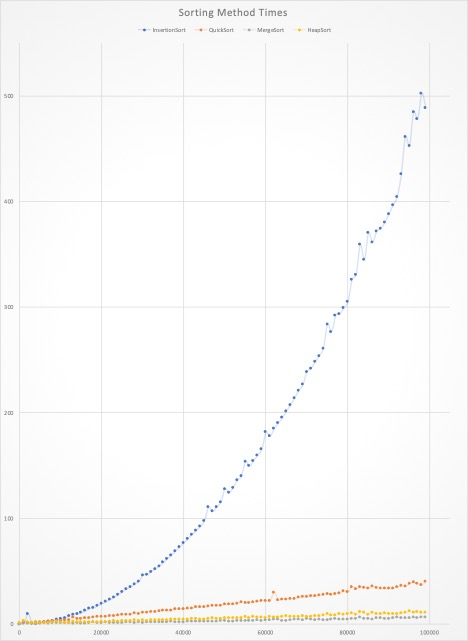

# cs241-project2

 My Name: Andrew Rose

 About This Project: Compares 4 different sorting methods: insertionSort, quickSort, mergeSort, and heapSort. This program will record the time of each sorting method with various different array sizes ranging from 100 to 100000 indexes. These results are then outputed to a CSV file and a png file is created to better visually represent this data.

 
